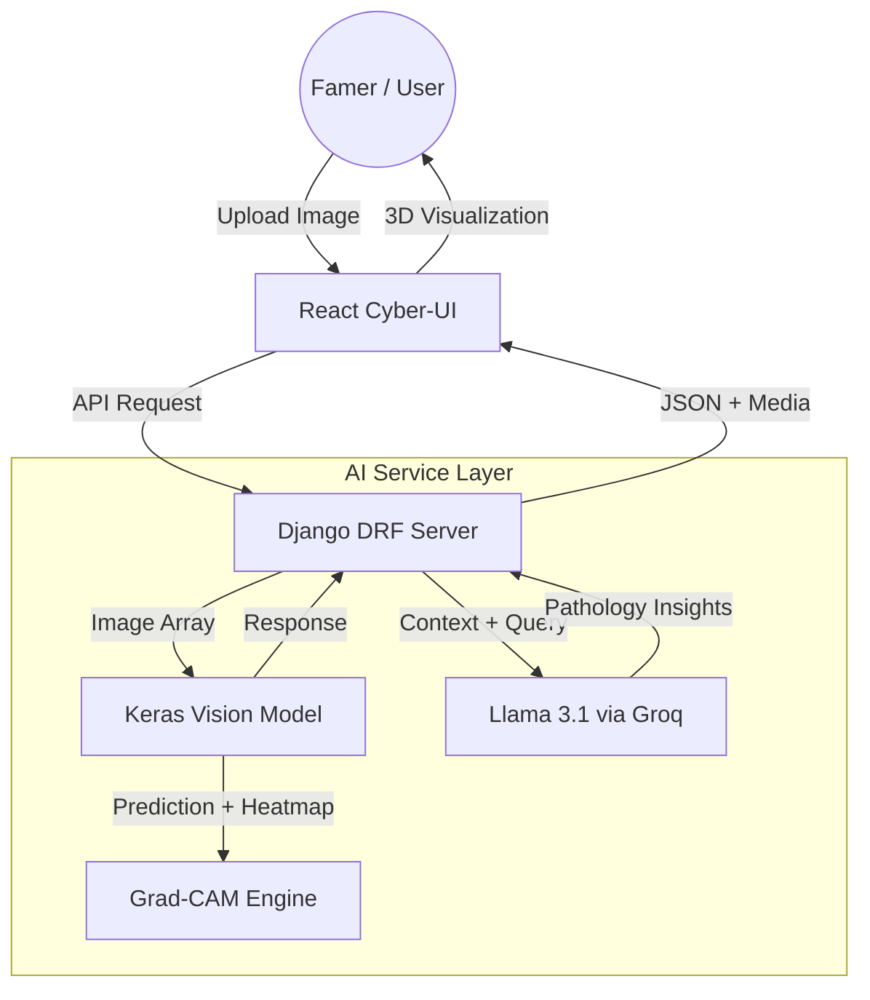

# Cyberpunk Version

## 🚀 Key Features
### 🔍 Neural Vision Scanner
Leverage a custom-trained Keras vision model to identify crop diseases with high precision. Just upload a photo of a leaf and the "Cyber-Eye" will diagnose the pathogen in milliseconds.

### 🧠 Explainable AI (XAI) - Grad-CAM
AgriBot doesn't just give you a result, it shows you 'why'. Using Grad-CAM (Gradient-weighted Class Activation Mapping), the system generates a heatmap over your original image, highlighting the specific features and patterns that led to the diagnosis.

### 🤖 CyberNet AI Copilot
Engage with a context-aware agricultural expert powered by Llama 3.1 (via Groq). The chatbot is tightly integrated with the vision system - if you scan a plant, the AI automatically knows what you're talking about when you ask for treatment advice.

### 💊 Predictive Treatment Engine
Beyond diagnosis, AgriBot generates dynamic treatment protocols. Get real-time data on -
- **Pathogen Cause** - Deep dive into the biological origin.
- **Strategic Action** - Step-by-step mitigation and fertilizer recommendations.
- **Risk Assessment** - Criticality levels to help prioritize crop care.

### 🌌 Premium Cyberpunk UI
A fully immersive experience featuring -
- **3D Visualization** - Leaf models and interactive components built with Three.js.
- **Glassmorphism** - Sleek, transparent UI panels with backdrop-blur effects.
- **Neon Aesthetics** - High-contrast cyan and pink themes for a futuristic feel.
- **Seamless Animations** - Driven by Framer Motion for a fluid, high-end UX.

## 🛠 The "Cyber-Stack"
### Frontend
- **Framework** - React.js (built with Vite).
- **3D Engine** - Three.js (@react-three/fiber, @react-three/drei).
- **Styling** - Tailwind CSS + Custom Glassmorphism.
- **Animations** - Framer Motion.
- **Graphs** - Recharts.

### Backend
- **Core** - Django (Python).
- **API** - Django Rest Framework (DRF).
- **Security** - JWT Authentication (SimpleJWT).
- **Database** - SQLite (Development).

### Neural Core & AI
- **Vision Model** - Custom CNN (Keras/TensorFlow).
- **XAI Engine** - Open Source Grad-CAM implementation.
- **LLM Core** - Llama-3.1-8b-instant (Inference via Groq API).

## 🏗 System Architecture
